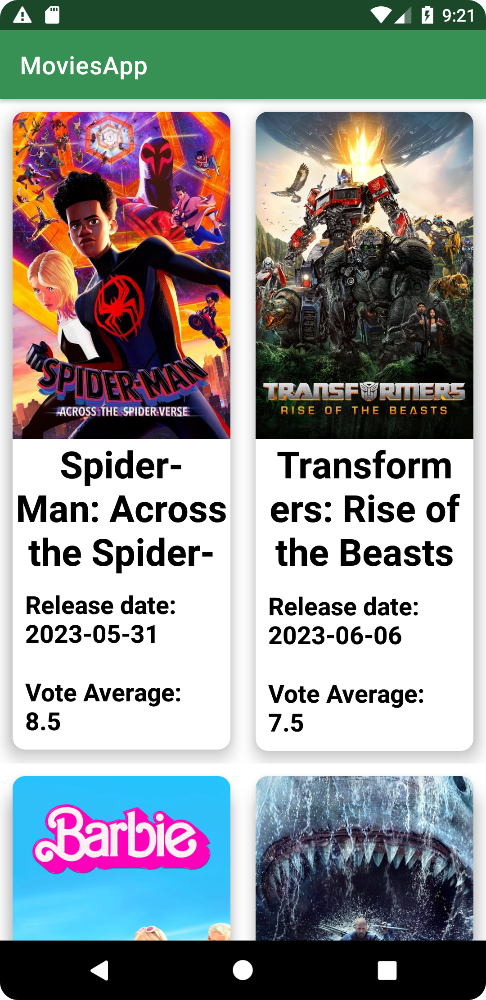
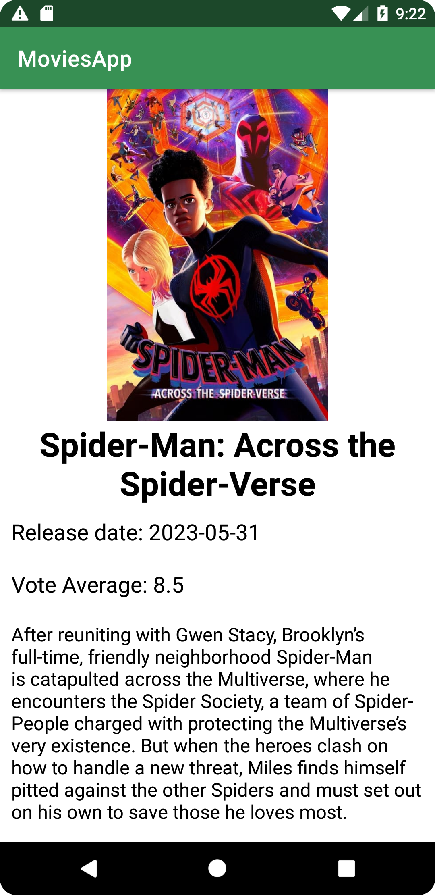

<h1 align="center">Movies App</h1>

  
  

   
  
  
  

  

⭐ This project was created to display my tech knowledge in native Android development with Kotlin. More techincal info below.

Movies App is a native Android App made with Kotlin. The app is capable of getting information from a RESTful API, using Retrofit; displaying the data (LiveData) in cards, inside a Recycler View; displaying movies posters with Glide and utilizing Clean Architecture and SOLID patterns to make the code clean, reusable and decoupled.

 

## Download

Download the <a href="apk/app-debug.apk?raw=true">APK </a> directly from this repo. You can check out <a href="https://www.google.com/search?q=how+to+install+apk+in+android">here</a> how to install an APK to your Android device.

# Tech Stack

- Minimum SDK Level 25
- <a href="https://kotlinlang.org/">Kotlin</a>

- Jetpack
  - Live Data:
  - Lifecycle
  - ViewModel
  - ViewBinding
  - Recycler View
    
- Architecture
  - MVVM
  - Clean Architecture
  - Repository pattern 

- Libraries  
  - [Glide](https://bumptech.github.io/glide/): 
  - [Retrofit & OkHTTP](https://square.github.io/retrofit/): 
  - [Koin](https://insert-koin.io/):

## Third Party APIs

[The Movies Database](https://www.themoviedb.org/?language=pt), this API provides all kind of data related to movies and series and it's completely free.

## Features

### Popular movies listing

Layout created with CardView and Linear Layout. The app consumes the Movies API with Retrofit and OkHttp, and mapping the response into a movie object displayed by the Recycler View

### Movie detail screen

Screen created to display the details about a movie card. This screen contains an abstract and others info about the movie selected. Those infos are passed by de Main Activity via Intent.

# License
aqui entra a licença
